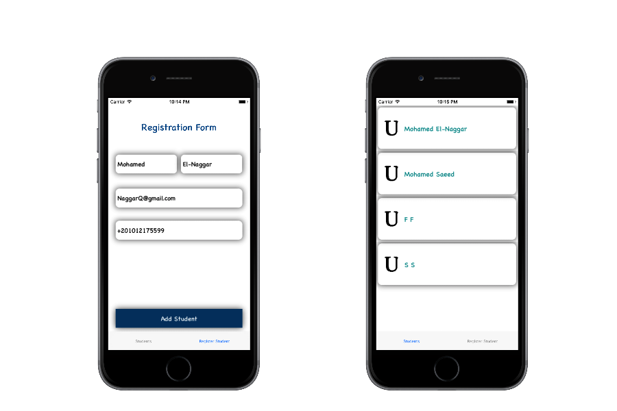
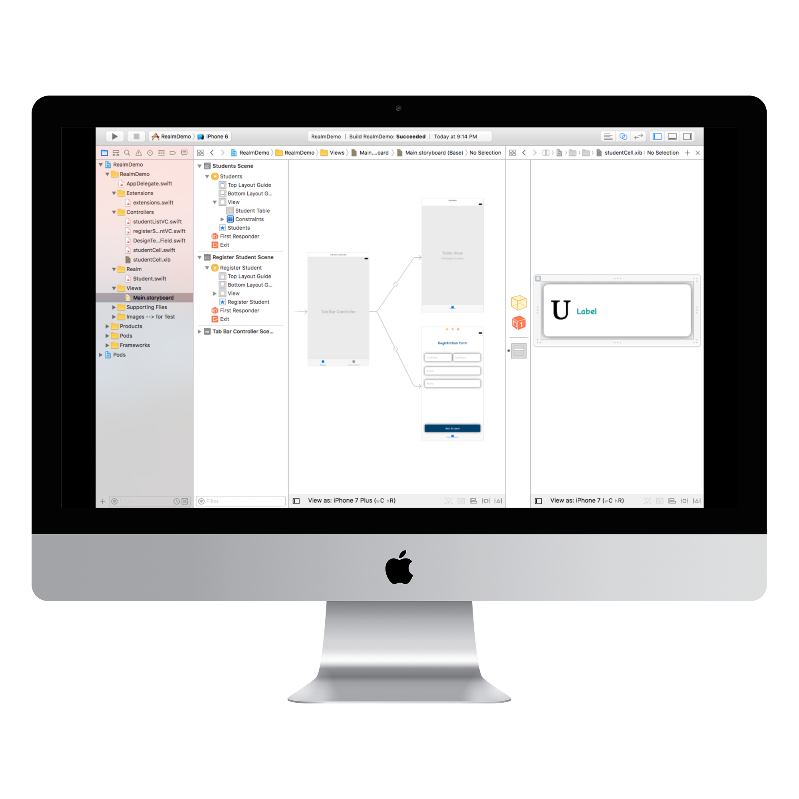

# RealmDEMO
simple iOS App that uses Realm Mobile DataBase for more info. please see https://realm.io


## Description
I just started learning about ``` Realm ``` Mobile DataBase it’s Very Simple and Powerful.

so I used to Practice for What I was learning so far

my App Contains 2 TapBar Controllers :

  * list out what is stored in Local DataBase on Device
  * You can Register New row in Realm Mobile DataBase

## Frames


StoryBoard


## CocoaPods integration

You can use [CocoaPods](http://cocoapods.org) to install ``` RealmSwift ``` adding it to your Podfile

install CocoaPods
```
$ sudo gem install cocoapods
```

then type 

```
$ pod install
```
